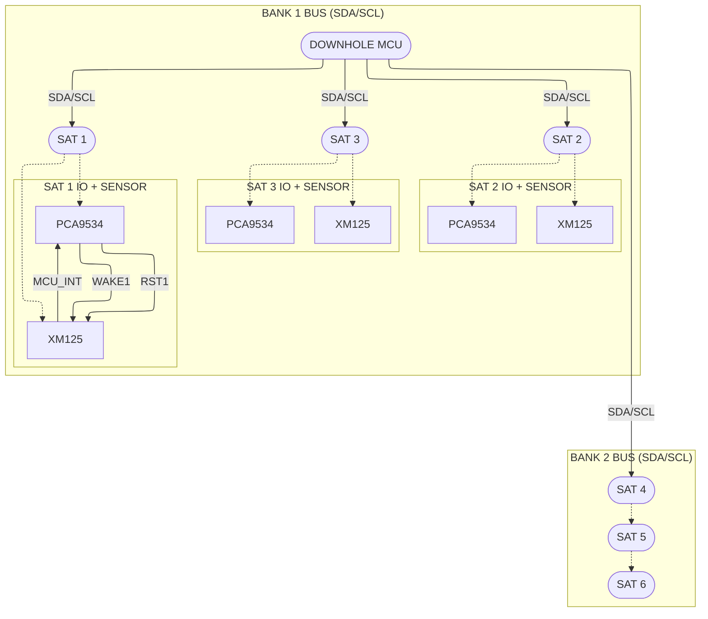

# System Connectivity & Logic Reference: Downhole to Void Satellite

**Source:** `SPEC 153 - BLASTSCOUT ELECTRONICS DOWNHOLE (2).pdf`, `SPEC 154 - BLASTSCOUT ELECTRONICS VOID (1).pdf`

This document details the electrical topology, I²C bus configuration, and hardware control logic connecting the Downhole MCU to the Void Satellite strings.

---

## Document Authority & Hierarchy (MASTER)

- MASTER hardware reference for Void system wiring, addressing, and control sequencing.
- Child documents:
  - XM125 register/protocol: see XM125_I2C_Distance_Detector_SPEC.md
  - PCA9534 I²C/registers: see PCA9534_I2C_Interface.md
- Default datasheet addresses and examples are overridden by this document where conflicts exist.

## Virtual Control Constraint (Global)

- `WAKE_UP`, `NRESET`, `MCU_INT` are physical XM125 pins.
- Only accessible via PCA9534 over I²C.
- Subject to I²C latency and serialization.
- Not interrupt-capable at the MCU level.

## Scope & Responsibility

This document defines system topology, device addressing, control wiring, and high-level sequencing via PCA9534. It explicitly defers device-specific I²C protocol semantics and register behavior to the respective device specifications (see cross-references below).

## Cross-References

- **XM125 I²C rules:** see [XM125_I2C_Distance_Detector_SPEC.md](XM125_I2C_Distance_Detector_SPEC.md), section X
- **PCA9534 register semantics:** see [PCA9534_I2C_Interface.md](PCA9534_I2C_Interface.md)

## Network Topology

The system is split into two independent electrical strings (I²C Banks) managed by the Downhole Master.

- **Master Node:** Downhole Main Board (STM32)
- **Transport:** Dual I²C Bus Architecture

| I²C Bank   | Assigned Satellites | Description      |
|------------|---------------------|------------------|
| **Bank 1** | Sat 1, Sat 2, Sat 3 | Primary String   |
| **Bank 2** | Sat 4, Sat 5, Sat 6 | Secondary String |

---

### Addressing Contract (Authoritative)

| Bus | Satellite | PCA9534 | XM125 |
|-----|-----------|---------|-------|
| 1   | SAT1      | 0x21    | 0x51  |
| 1   | SAT2      | 0x22    | 0x52  |
| 1   | SAT3      | 0x23    | 0x53  |
| 2   | SAT4      | 0x21    | 0x51  |
| 2   | SAT5      | 0x22    | 0x52  |
| 2   | SAT6      | 0x23    | 0x53  |

> Satellite identity is defined by (I²C bus, device address).
> XM125 behavior is identical across all satellites.
> Ignore component datasheet defaults; use this table.
> **PCA9534 Configuration Register init byte = `0x5F` (binary `0b01011111`: IO7 & IO5 outputs, IO6 input, others inputs).**
> **PCA9534 Output Register init byte = `0xA0` (binary `0b10100000`: NRESET high on IO7, WAKE_UP high on IO5).**

## Bus Interconnections

Each string is a continuous daisy-chain carrying both power and data signals.

### Signal Lines (S1 & S2 Connectors)

The interconnect consists of the following lines routing through the satellites:

- **SDA (Serial Data):** Continuous line shared by all devices on the bank
- **SCL (Serial Clock):** Continuous line shared by all devices on the bank
- **5V Rail:** Main supply
- **3V3 Rail:** Logic supply
- **1V8 Rail:** Radar RF supply
- **GND:** Common Ground

### Device Addressing

Every satellite contains two I²C devices sharing the bus. Addresses are hardware-configured based on position.

| Component   | Function       | I²C Address               |
|-------------|----------------|---------------------------|
| **XM125**   | Radar Sensor   | `0x51`, `0x52`, or `0x53` |
| **PCA9534** | I/O Controller | Configured to match ID    |

---

## Satellite Logic & Pin States

### Virtual Control Layer Definition

- Downhole MCU has no physical control lines to XM125.
- PCA9534 is mandatory for all control and observation.
- Control-plane operations precede any XM125 data-plane access.

Direct control of the XM125 Radar is not possible from the Downhole MCU. All control and state visibility is mediated via the **PCA9534 I/O Expander**.

### PCA9534 to XM125 Mapping (Authoritative GPIO Table)

The PCA9534 translates I²C commands into physical logic states and input sensing for the XM125.

| PCA9534 Pin | Direction | Target XM125 Pin | Function            | Active State | Logic Description                                  |
|-------------|-----------|------------------|---------------------|--------------|----------------------------------------------------|
| **IO 5**    | Output    | **WAKE_UP**      | Power State Control | **HIGH**     | `1` = Wake / Run, `0` = Sleep                      |
| **IO 7**    | Output    | **NRESET**       | Hardware Reset      | **LOW**      | `0` = Hold in Reset, `1` = Release / Run           |
| **IO 6**    | Input     | **MCU_INT**      | Status / Ready Flag | **HIGH**     | `1` = Module Ready / Measurement Ready (mode-dep.) |

Notes:

- IO6 is input-only; MCU_INT is read-only.
- PCA9534 `INT` pin is unused in this design.

---

## Control vs Data Plane

- PCA9534 is the sole control-plane interface (WAKE_UP, NRESET, MCU_INT).
- XM125 is data-plane only (register protocol and measurements).
- XM125 I²C access is prohibited unless MCU_INT is HIGH.
- PCA9534 access is always permitted when the bus is otherwise idle.

## Hardware Control & Readiness Sequences

Required:

- All sequences must be performed via PCA9534.
- Polling of MCU_INT is required; fixed delays are forbidden.
- Polling loops MUST include a safety timeout (e.g., 100ms). If timeout occurs, mark Satellite as FAILED/OFFLINE. Infinite blocking is forbidden.
- XM125 access while MCU_INT LOW is undefined behavior.

All sequences assume control and observation via the PCA9534 only.
`MCU_INT` is observed by reading the PCA9534 input port.

Detailed I²C protocol rules are defined in the XM125 specification and are not repeated here.

WAKE/READY timing rules are defined by XM125 behavior; this document only describes how those signals are routed.

### Power-Up / Wake Sequence

1. Set **IO 5 (WAKE_UP)** = `1`
2. Set **IO 7 (NRESET)** = `1`
3. Wait until **IO 6 (MCU_INT)** reads `HIGH`
4. XM125 is awake and ready for I²C communication

### Sleep Sequence

1. Verify **IO 6 (MCU_INT)** reads `HIGH`
2. Set **IO 5 (WAKE_UP)** = `0`
3. Wait until **IO 6 (MCU_INT)** reads `LOW`
4. XM125 is in low-power state

### Hard Reset Sequence

1. Set **IO 5 (WAKE_UP)** = `0`
2. Set **IO 7 (NRESET)** = `0`
3. Hold reset for required minimum duration
4. Set **IO 7 (NRESET)** = `1`
5. Set **IO 5 (WAKE_UP)** = `1`
6. Wait until **IO 6 (MCU_INT)** reads `HIGH`
7. XM125 reset complete and ready

> I²C transaction semantics (STOP vs repeated START) are device-specific and defined in the respective device specifications.

---

## Hardware Visibility of XM125 State

**Hardware Reality:**

The **XM125 `MCU_INT`** pin is routed to a **PCA9534 GPIO configured as an input**.
The PCA9534 **INT pin remains unconnected**.
All status observation is performed via I²C reads of the PCA9534 input register.

**Operational Impact:**

1. XM125 readiness and state transitions are externally observable
2. No direct interrupt path exists to the Downhole MCU
3. All observation and control is performed over the I²C bus
4. Hardware state transitions can be verified rather than inferred by delay

---

## MCU_INT Semantics (Invariant)

- MCU_INT is a level-based readiness signal
- MCU_INT HIGH ⇒ XM125 ready for I²C
- MCU_INT LOW ⇒ XM125 busy or asleep
- MCU_INT is polled, never interrupt-driven
- Any XM125 I²C transaction while MCU_INT LOW is undefined behavior

## Connection Diagram

