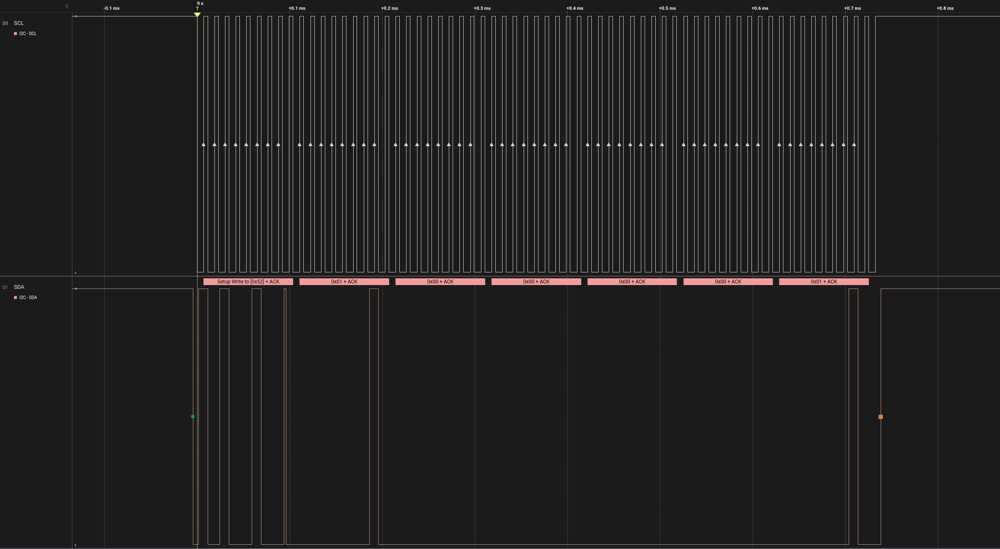
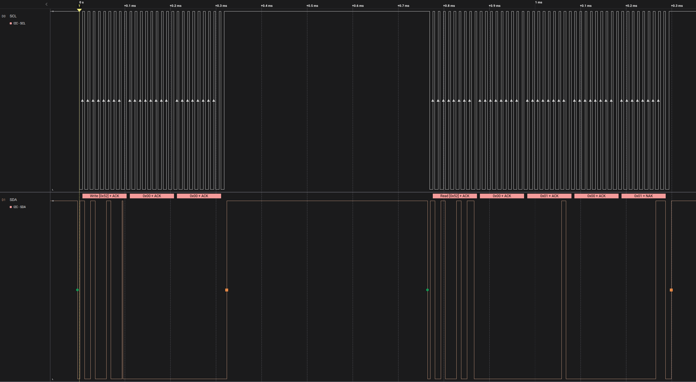
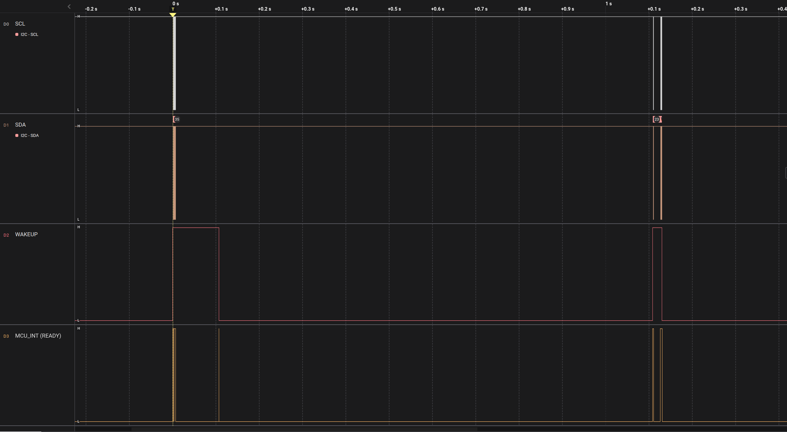
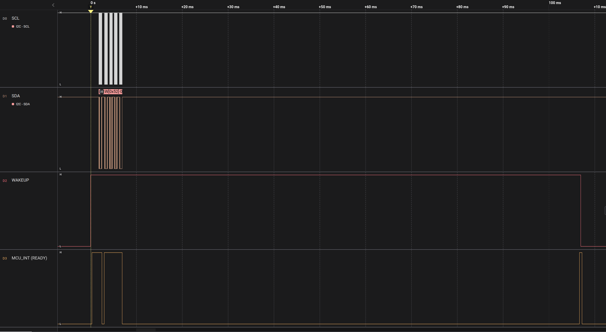
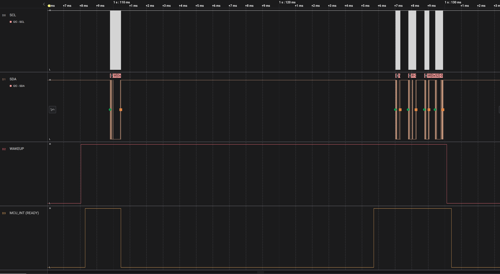
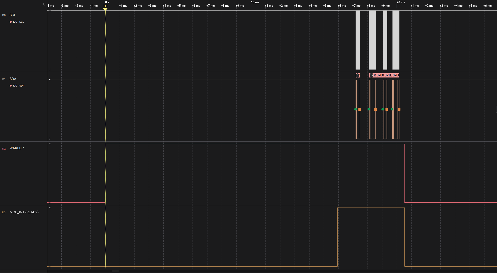

# XM125 I2C Distance Detector — I²C Register Interface (Full Transfer)

**Source:** XM125-I2C-Distance-Detector-User-Guide.pdf

*This file is a maximal-fidelity transfer of the PDF contents into Markdown. Tables are converted when reliably parseable; otherwise preserved as fixed-width text blocks.*

> System Warning (Void Satellite):
> XM125 pins are virtual from the MCU perspective.
> PCA9534 must be used to drive `WAKE_UP`/`NRESET` and to read `MCU_INT`.
> Refer to Hardware.md for GPIO mapping and system wiring.

## Virtual Control Constraint (Global)

- `WAKE_UP`, `NRESET`, `MCU_INT` are physical XM125 pins.
- Only accessible via PCA9534 over I²C.
- Subject to I²C latency and serialization.
- Not interrupt-capable at the MCU level.

## Scope & Responsibility

Defines XM125 register protocol and I²C transaction semantics, including address/data byte order and command execution rules. Explicitly defers GPIO wiring, control-plane topology, and satellite addressing to the system hardware specification.

## Extracted Figures



Firmware takeaway: Write uses 2 address bytes + 4 data bytes per register; STOP terminates each write.



Firmware takeaway: STOP between address write and data read; NACK final byte; repeated-start reads not supported.



Firmware takeaway: No I²C bus traffic while MCU_INT is LOW; wake, wait for MCU_INT HIGH, then access.



Firmware takeaway: Setup/calibrate only after MCU_INT transitions HIGH following WAKE_UP.



Firmware takeaway: Issue measure command only when MCU_INT is HIGH; ensure STOPs per transaction.



Firmware takeaway: With Measure-on-Wake enabled, results are ready at MCU_INT HIGH; defer data reads until then.

---

## User Guide

---

**Author:** Acconeer AB
**Version:** a121-v1.12.0
**Date:** October 15, 2025

---

## Contents

1. [I2C Distance Detector Application](#2-i2c-distance-detector-application)
   - [I2C Address Configuration](#21-i2c-address-configuration)
   - [I2C Speed](#22-i2c-speed)
   - [Usage](#23-usage)
     - [Read Detector Status](#231-read-detector-status)
     - [Writing a Command](#232-writing-a-command)
     - [Setup and Measure](#233-setup-and-measure)
   - [Advanced Usage](#24-advanced-usage)
     - [Apply Configuration and Calibration Separately](#241-apply-configuration-and-calibration-separately)
     - [Re-calibration](#242-re-calibration)
     - [Measure on Wake Up Mode](#243-measure-on-wake-up-mode)
     - [Debug UART Logs](#244-debug-uart-logs)
     - [Reset Module](#245-reset-module)
2. [Register Protocol](#3-register-protocol)
   - [I2C Slave Address](#31-i2c-slave-address)
   - [Protocol Byte Order](#32-protocol-byte-order)
     - [I2C Write Register(s)](#321-i2c-write-registers)
     - [I2C Read Register(s)](#322-i2c-read-registers)
   - [Register Protocol - Low Power Mode](#33-register-protocol---low-power-mode)
     - [I2C Communication with Low Power Mode](#331-i2c-communication-with-low-power-mode)
3. [File Structure](#4-file-structure)
4. [Embedded Host Example](#5-embedded-host-example)
   - [Register Read/Write Functions](#51-register-readwrite-functions)
   - [Detector Setup Functions](#52-detector-setup-functions)
5. [Registers](#6-registers)
   - [Register Map](#61-register-map)
   - [Register Descriptions](#62-register-descriptions)
6. [Disclaimer](#7-disclaimer)

---

## Firmware Invariants

- XM125 I²C is forbidden while MCU_INT (via PCA9534) is LOW
- MCU_INT HIGH is the only readiness indicator
- Register address = 16-bit, MSB first
- Register data = 32-bit, MSB first
- STM32 is Little-Endian. Firmware MUST manually swap bytes before TX and after RX. Do not rely on peripheral automatic swapping.
- STOP required between address write and read
- Repeated-start reads are not supported
- No auto-increment beyond documented multi-register operations
- Behavior is identical across satellites

## MCU_INT Semantics

MCU_INT is driven by the XM125 and signals readiness at the system level.

- When WAKE_UP is asserted HIGH, wait until MCU_INT becomes HIGH before any I²C access.
- When WAKE_UP is deasserted LOW, MCU_INT will go LOW; no I²C transactions are permitted while LOW.
- Firmware may issue I²C transactions only when MCU_INT is HIGH; any transaction while LOW is undefined behavior.

## System Addressing Context (Reference)

Addressing is defined by system hardware; this table is for reference only.

| Bus | Satellite | PCA9534 | XM125 |
|-----|-----------|---------|-------|
| 1   | SAT1      | 0x21    | 0x51  |
| 1   | SAT2      | 0x22    | 0x52  |
| 1   | SAT3      | 0x23    | 0x53  |
| 2   | SAT4      | 0x21    | 0x51  |
| 2   | SAT5      | 0x22    | 0x52  |
| 2   | SAT6      | 0x23    | 0x53  |

## 2 I2C Distance Detector Application

The I2C Distance Detector is an application that implements the Acconeer Distance Detector with a register based I2C interface.

The functionality of the distance detector is described in A121 Distance Detector User Guide.pdf or in Acconeer Docs.

> Note: Some of the registers like start and end have a different unit in the I2C Distance Detector, millimeters instead of meters, to make it easier to handle the register values as integers.

### 2.1 I2C Address Configuration

The device has a configurable I2C address. The address is selected depending on the state of the I2C ADDR pin according to the following table:

| I2C ADDR pin state | 7-bit address |
|--------------------|---------------|
| Connected to GND   | `0x51`        |
| Not connected      | `0x52`        |
| Connected to VIN   | `0x53`        |

### 2.2 I2C Speed

The device supports I2C speed up to 100kbps in Standard Mode and up to 400kbps in Fast Mode.

### 2.3 Usage

The module must be ready before the host starts I2C communication.

The module will enter ready state by following this procedure:

- Set WAKE UP pin of the module HIGH.
- Wait for module to be ready, this is indicated by the MCU INT pin being HIGH.
- Start I2C communication.

The module will enter a low power state by following this procedure:

- Wait for module to be ready, this is indicated by the MCU INT pin being HIGH.
- Set the WAKE UP pin of the module LOW.
- Wait for ready signal, the MCU INT pin, to become LOW.

#### 2.3.1 Read Detector Status

The status of the module can be acquired by reading the Detector Status register. The most important bits are the Busy and Error bits.

The Busy bit must not be set when a new command is written. If any of the Error bits are set the module will not accept any commands except the RESET MODULE command.

#### 2.3.2 Writing a command

A command is written to the Command register. When a command is written the Busy bit in the Detector Status register is set and it will be cleared automatically when the command has finished.

#### 2.3.3 Setup and Measure

Before the module can perform distance measurements it must be configured and calibrated. The following steps is an example of how this can be achieved.

> Note: The configuration parameters cannot be changed after an APPLY CONFIG AND CALIBRATE or an APPLY CONFIGURATION command. If reconfiguration is needed the module must be restarted by writing RESET MODULE to the Command register.

- Power on module
- Read Detector Status register and verify that neither Busy nor Error bits are set.
- Write configuration to configuration registers, for example Start register and End register.
- Write APPLY CONFIG AND CALIBRATE to Command register.
- Poll Detector Status until Busy bit is cleared.
- Verify that no Error bits are set in the Detector Status register.
- Write MEASURE DISTANCE to Command register.
- Poll Detector Status until Busy bit is cleared.
- Verify that no Error bits are set in the Detector Status register.
- Read Detector Result register
  - If MEASURE DISTANCE ERROR is set the measurement failed.
  - If CALIBRATION NEEDED is set the sensor needs to be re-calibrated with the RECALIBRATE command.
  - The number of peak distances detected can be read in the NUM DISTANCES field.
- Read PeakX Distance and PeakX Strength registers depending on how many distances that were detected.
- The module is ready for a new MEASURE DISTANCE command.

### 2.4 Advanced Usage

#### 2.4.1 Apply Configuration and Calibration separately

Some use-cases require control over when the system is calibrated, therefore the Apply Configuration and Calibrate can be performed as individual steps.

- Power on module
- Read Detector Status register and verify that neither Busy nor Error bits are set.
- Write configuration to configuration registers, for example Start register and End register.
- Write APPLY CONFIGURATION to Command register
- Poll Detector Status until Busy bit is cleared.
- Verify that no Error bits are set in the Detector Status register.
- Write CALIBRATE to Command register
- Poll Detector Status until Busy bit is cleared.
- Verify that no Error bits are set in the Detector Status register.
- The module is ready for a MEASURE DISTANCE command.

#### 2.4.2 Re-calibration

Re-calibration must be done as soon as the CALIBRATION NEEDED bit is set in the Detector Result register.

Re-calibration is performed by writing RECALIBRATE to the Command register.

#### 2.4.3 Measure on Wake Up Mode

Measure on Wake Up mode can be enabled by writing a non-zero value to the Measure On Wakeup register. When Measure on Wake Up is enabled, the module will perform a distance measurement every time it is woken by the WAKE UP pin. The measurement will be ready when the MCU INT pin becomes HIGH.

#### 2.4.4 Debug UART logs

UART logging can be enabled on the DEBUG UART by writing ENABLE UART LOGS to the Command register.

The detector configuration can be logged on the UART by writing LOG CONFIGURATION to the Command register.

UART logging can be disabled by writing DISABLE UART LOGS to the Command register.

#### 2.4.5 Reset Module

The module can be restarted by writing RESET MODULE to the Command register.

After the restart the detector must be configured again.

---

## 3 Register Protocol

Canonical read transaction:

```ascii
WAIT MCU_INT == HIGH
START
SLA+W
REG_MSB REG_LSB
STOP
START
SLA+R
DATA[31:0] (MSB first)
NACK
STOP
```

> **RULE:** Host MUST NOT issue any I²C transaction while MCU_INT is LOW.
> **RULE:** MCU_INT HIGH is the only valid readiness indicator.

### 3.1 I2C Slave Address

The default slave address is 0x52.

### 3.2 Protocol Byte Order

Both register address (16-bit) and register data (32-bit) are sent in big endian byte order.

#### 3.2.1 I2C Write Register(s)

A write register operation consists of an I2C write of two address bytes and four data bytes for each register to write. Several registers can be written in the same I2C transaction, the register address will be incremented by one for each four data bytes.

Example 1: Writing six bytes will write one register, two address bytes and four data bytes.
Example 2: Writing 18 bytes will write four registers, two address bytes and 16 data bytes.

Example operation, write `0x11223344` to address `0x0025`:

| Description             | Data     |
|-------------------------|----------|
| I2C Start Condition     |          |
| Slave Address + Write   | 0x52 + W |
| Address to slave [15:8] | 0x00     |
| Address to slave [7:0]  | 0x25     |
| Data to slave [31:24]   | 0x11     |
| Data to slave [23:16]   | 0x22     |
| Data to slave [15:8]    | 0x33     |
| Data to slave [7:0]     | 0x44     |
| I2C Stop Condition      |          |

All bytes must be ACKed by the slave.
Each write transaction must be terminated with a STOP condition (not a repeated START).

#### 3.2.2 I2C Read Register(s)

A read register operation consists of an I2C write of two address bytes followed by an I2C read of four data bytes for each register to read. Several registers can be read in the same I2C transaction, the register address will be incremented by one for each four data bytes.

Example 1: Writing two bytes and reading four bytes will read one register.
Example 2: Writing two bytes and reading 16 bytes will read four registers.

Example operation, read `0x12345678` from address `0x0003`:

| Description             | Data     |
|-------------------------|----------|
| I2C Start Condition     |          |
| Slave Address + Write   | 0x52 + W |
| Address to slave [15:8] | 0x00     |
| Address to slave [7:0]  | 0x03     |
| I2C Stop Condition      |          |
| I2C Start Condition     |          |
| Slave Address + Read    | 0x52 + R |
| Data from slave [31:24] | 0x12     |
| Data from slave [23:16] | 0x34     |
| Data from slave [15:8]  | 0x56     |
| Data from slave [7:0]   | 0x78     |
| I2C Stop Condition      |          |

The host must NACK the final byte of the read.
STOP between write and read is required (do not use repeated START).

---

### 3.3 Register Protocol - Low Power Mode

#### 3.3.1 I2C Communication with Low Power Mode

Low power example:
Wake up, Setup Distance Detector, Power down, Wait 1s, Wake up, Measure distance, Power down.

Low Power Example: Magnification of Wake up, Setup Distance Detector, Power down.

Low Power Example: Magnification of Wake up, Measure distance, Power down.

Low power example with 'Measure on wake up':
Measure on Wake Up Example: Magnification of Wake up, Measure on wake up, Power down.

---

## 4 File Structure

The I2C Distance Detector application consists of the following files:

```text
Src/
  applications/
    i2c/
      acc_reg_protocol.c
      distance_reg_protocol.c
      i2c_application_system_stm32.c
      i2c_distance_detector.c
Inc/
  acc_reg_protocol.h
  distance_reg_protocol.h
  i2c_application_system.h
  i2c_distance_detector.h
```

- `acc_reg_protocol.c`: A generic protocol handler implementation.
- `distance_reg_protocol.c`: The specific register protocol setup for the I2C Distance Detector.
- `i2c_application_system_stm32.c`: System functions, such as I2C handling, GPIO control and low power state.
- `i2c_distance_detector.c`: The I2C Distance Detector application.

---

## 5 Embedded Host Example

This is an example implementation of the host read and write register functions using the STM32 SDK.

> Examples assume correct bus/address selection and MCU_INT already HIGH.
> Replace any direct GPIO calls with PCA9534 I²C operations.

GPIO-to-PCA9534 mapping (Void Satellite):

| Action                | Register      | Pointer | Bit | Mask | Operation        |
|-----------------------|---------------|---------|-----|------|------------------|
| Drive WAKE_UP HIGH    | Output Port   | 0x01    | 0   | 0x01 | Set bit 0 to 1   |
| Drive WAKE_UP LOW     | Output Port   | 0x01    | 0   | 0x01 | Clear bit 0 to 0 |
| Release NRESET (HIGH) | Output Port   | 0x01    | 1   | 0x02 | Set bit 1 to 1   |
| Assert NRESET (LOW)   | Output Port   | 0x01    | 1   | 0x02 | Clear bit 1 to 0 |
| Read MCU_INT level    | Input Port    | 0x00    | 2   | 0x04 | Read bit 2       |
| Configure directions  | Configuration | 0x03    | -   | -    | Write 0x04       |
| Set initial outputs   | Output Port   | 0x01    | -   | -    | Write 0x02       |

### 5.1 Register Read/Write functions

```c
#include <inttypes.h>
#include <stdbool.h>
#include <stdint.h>
#include "distance_reg_protocol.h"

// Use 1000 ms timeout
#define I2C_TIMEOUT_MS 1000

// The STM32 uses the i2c address shifted one position to the left (0x52 becomes 0xa4)
#define I2C_ADDR 0xa4

// The register address length is two bytes
#define REG_ADDRESS_LENGTH 2

// The register data length is four bytes
#define REG_DATA_LENGTH 4

/**
 * @brief Read register value over I2C
 * @param[in] reg_addr The register address to read
 * @param[out] reg_data The read register data
 * @returns true if successful
 */
bool read_register(uint16_t reg_addr, uint32_t *reg_data)
{
    HAL_StatusTypeDef status = HAL_OK;
    uint8_t transmit_data[REG_ADDRESS_LENGTH];
    transmit_data[0] = (reg_addr >> 8) & 0xff;
    transmit_data[1] = (reg_addr >> 0) & 0xff;
    status = HAL_I2C_Master_Transmit(&STM32_I2C_HANDLE, I2C_ADDR, transmit_data, REG_ADDRESS_LENGTH, I2C_TIMEOUT_MS);
    if (status != HAL_OK) {
        return false;
    }
    uint8_t receive_data[REG_DATA_LENGTH];
    status = HAL_I2C_Master_Receive(&STM32_I2C_HANDLE, I2C_ADDR, receive_data, REG_DATA_LENGTH, I2C_TIMEOUT_MS);
    if (status != HAL_OK) {
        return false;
    }
    // Convert bytes to uint32_t
    uint32_t val = receive_data[0];
    val = (val << 8) | receive_data[1];
    val = (val << 8) | receive_data[2];
    val = (val << 8) | receive_data[3];
    *reg_data = val;
    return true;
}

/**
 * @brief Write register value over I2C
 * @param[in] reg_addr The register address to write
 * @param[in] reg_data The register data to write
 * @returns true if successful
 */
bool write_register(uint16_t reg_addr, uint32_t reg_data)
{
    HAL_StatusTypeDef status = HAL_OK;
    uint8_t transmit_data[REG_ADDRESS_LENGTH + REG_DATA_LENGTH];
    // Convert uint16_t address to bytes
    transmit_data[0] = (reg_addr >> 8) & 0xff;
    transmit_data[1] = (reg_addr >> 0) & 0xff;
    // Convert uint32_t reg_data to bytes
    transmit_data[2] = (reg_data >> 24) & 0xff;
    transmit_data[3] = (reg_data >> 16) & 0xff;
    transmit_data[4] = (reg_data >> 8) & 0xff;
    transmit_data[5] = (reg_data >> 0) & 0xff;
    status = HAL_I2C_Master_Transmit(&STM32_I2C_HANDLE, I2C_ADDR, transmit_data, REG_ADDRESS_LENGTH + REG_DATA_LENGTH, I2C_TIMEOUT_MS);
    if (status != HAL_OK) {
        return false;
    }
    return true;
}
```

### 5.2 Detector setup functions

```c
#include "distance_reg_protocol.h"

/**
 * @brief Test if configuration of detector is OK
 * @returns true if successful
 */
bool configuration_ok(void)
{
    uint32_t status = 0;
    if (!read_register(DISTANCE_REG_DETECTOR_STATUS_ADDRESS, &status)) {
        // ERROR
        return false;
    }
    uint32_t config_ok_mask =
        DISTANCE_REG_DETECTOR_STATUS_FIELD_RSS_REGISTER_OK_MASK |
        DISTANCE_REG_DETECTOR_STATUS_FIELD_CONFIG_CREATE_OK_MASK |
        DISTANCE_REG_DETECTOR_STATUS_FIELD_SENSOR_CREATE_OK_MASK |
        DISTANCE_REG_DETECTOR_STATUS_FIELD_DETECTOR_CREATE_OK_MASK |
        DISTANCE_REG_DETECTOR_STATUS_FIELD_DETECTOR_BUFFER_OK_MASK |
        DISTANCE_REG_DETECTOR_STATUS_FIELD_SENSOR_BUFFER_OK_MASK |
        DISTANCE_REG_DETECTOR_STATUS_FIELD_CALIBRATION_BUFFER_OK_MASK |
        DISTANCE_REG_DETECTOR_STATUS_FIELD_CONFIG_APPLY_OK_MASK |
        DISTANCE_REG_DETECTOR_STATUS_FIELD_SENSOR_CALIBRATE_OK_MASK |
        DISTANCE_REG_DETECTOR_STATUS_FIELD_DETECTOR_CALIBRATE_OK_MASK;
    if (status != config_ok_mask) {
        // ERROR
        return false;
    }
    return true;
}

/**
 * @brief Wait for detector not busy
 * @returns true if successful
 */
bool wait_not_busy(void)
{
    uint32_t status = 0;
    do {
        if (!read_register(DISTANCE_REG_DETECTOR_STATUS_ADDRESS, &status)) {
            // ERROR
            return false;
        }
    } while ((status & DISTANCE_REG_DETECTOR_STATUS_FIELD_BUSY_MASK) != 0);
    return true;
}

bool example_setup_and_measure(void)
{
    // Set start at 1000 mm
    if (!write_register(DISTANCE_REG_START_ADDRESS, 1000)) {
        // ERROR
        return false;
    }
    // Set end at 5000 mm
    if (!write_register(DISTANCE_REG_END_ADDRESS, 5000)) {
        // ERROR
        return false;
    }
    // Apply configuration
    if (!write_register(DISTANCE_REG_COMMAND_ADDRESS, DISTANCE_REG_COMMAND_ENUM_APPLY_CONFIG_AND_CALIBRATE)) {
        // ERROR
        return false;
    }
    // Wait for the configuration and calibration to be done
    if (!wait_not_busy()) {
        // ERROR
        return false;
    }
    // Test if configuration of detector was OK
    if (!configuration_ok()) {
        // ERROR
        return false;
    }
    // Measure
    if (!write_register(DISTANCE_REG_COMMAND_ADDRESS, DISTANCE_REG_COMMAND_ENUM_MEASURE_DISTANCE)) {
        // ERROR
        return false;
    }
    // Wait for measure distance to be done
    if (!wait_not_busy()) {
        // ERROR
        return false;
    }
    // Read detector result
    uint32_t result;
    if (!read_register(DISTANCE_REG_DISTANCE_RESULT_ADDRESS, &result)) {
        // ERROR
        return false;
    }
    // Did we detect a peak?
    uint32_t num_distances = (result & DISTANCE_REG_DISTANCE_RESULT_FIELD_NUM_DISTANCES_MASK) >>
        DISTANCE_REG_DISTANCE_RESULT_FIELD_NUM_DISTANCES_POS;
    // Print peak if found
    if (num_distances > 0) {
        uint32_t peak_distance_mm;
        if (read_register(DISTANCE_REG_PEAK0_DISTANCE_ADDRESS, &peak_distance_mm)) {
            printf("Peak distance: %" PRIu32 " mm\n", peak_distance_mm);
        } else {
            // ERROR
            return false;
        }
    } else {
        printf("No peak detected\n");
    }
    return true;
}
```

---

## 6 Registers

### 6.1 Register Map

| Address | Register Name                    | Type       |
|---------|----------------------------------|------------|
| 0x0000  | Version                          | Read Only  |
| 0x0001  | Protocol Status                  | Read Only  |
| 0x0002  | Measure Counter                  | Read Only  |
| 0x0003  | Detector Status                  | Read Only  |
| 0x0010  | Distance Result                  | Read Only  |
| 0x0011  | Peak0 Distance                   | Read Only  |
| 0x0012  | Peak1 Distance                   | Read Only  |
| 0x0013  | Peak2 Distance                   | Read Only  |
| 0x0014  | Peak3 Distance                   | Read Only  |
| 0x0015  | Peak4 Distance                   | Read Only  |
| 0x0016  | Peak5 Distance                   | Read Only  |
| 0x0017  | Peak6 Distance                   | Read Only  |
| 0x0018  | Peak7 Distance                   | Read Only  |
| 0x0019  | Peak8 Distance                   | Read Only  |
| 0x001a  | Peak9 Distance                   | Read Only  |
| 0x001b  | Peak0 Strength                   | Read Only  |
| 0x001c  | Peak1 Strength                   | Read Only  |
| 0x001d  | Peak2 Strength                   | Read Only  |
| 0x001e  | Peak3 Strength                   | Read Only  |
| 0x001f  | Peak4 Strength                   | Read Only  |
| 0x0020  | Peak5 Strength                   | Read Only  |
| 0x0021  | Peak6 Strength                   | Read Only  |
| 0x0022  | Peak7 Strength                   | Read Only  |
| 0x0023  | Peak8 Strength                   | Read Only  |
| 0x0024  | Peak9 Strength                   | Read Only  |
| 0x0040  | Start                            | Read/Write |
| 0x0041  | End                              | Read/Write |
| 0x0042  | Max Step Length                  | Read/Write |
| 0x0043  | Close Range Leakage Cancellation | Read/Write |
| 0x0044  | Signal Quality                   | Read/Write |
| 0x0045  | Max Profile                      | Read/Write |
| 0x0046  | Threshold Method                 | Read/Write |
| 0x0047  | Peak Sorting                     | Read/Write |
| 0x0048  | Num Frames Recorded Threshold    | Read/Write |
| 0x0049  | Fixed Amplitude Threshold Value  | Read/Write |
| 0x004a  | Threshold Sensitivity            | Read/Write |
| 0x004b  | Reflector Shape                  | Read/Write |
| 0x004c  | Fixed Strength Threshold Value   | Read/Write |
| 0x0080  | Measure On Wakeup                | Read/Write |
| 0x0100  | Command                          | Write Only |
| 0xffff  | Application Id                   | Read Only  |

---

## Anti-patterns

- Repeated-start reads
- Polling or issuing transactions while MCU_INT LOW
- Treating MCU_INT as an interrupt source
- Assuming SMBus semantics
- Assuming 8-bit registers (addresses and data are 16/32-bit, MSB first)
- Broadcasting transactions across satellites

### 6.2 Register Descriptions

The following sections describe each register in detail.

#### 6.2.1 Version

- **Address:** 0x0000
- **Access:** Read Only
- **Register Type:** field
- **Description:** Get the RSS version.

| Bitfield | Pos | Width | Mask       |
|----------|-----|-------|------------|
| MAJOR    | 16  | 16    | 0xffff0000 |
| MINOR    | 8   | 8     | 0x0000ff00 |
| PATCH    | 0   | 8     | 0x000000ff |

- **MAJOR** - Major version number
- **MINOR** - Minor version number
- **PATCH** - Patch version number

#### 6.2.2 Protocol Status

- **Address:** 0x0001
- **Access:** Read Only
- **Register Type:** field
- **Description:** Get protocol error flags.

| Bitfield             | Pos | Width | Mask       |
|----------------------|-----|-------|------------|
| PROTOCOL STATE ERROR | 0   | 1     | 0x00000001 |
| PACKET LENGTH ERROR  | 1   | 1     | 0x00000002 |
| ADDRESS ERROR        | 2   | 1     | 0x00000004 |
| WRITE FAILED         | 3   | 1     | 0x00000008 |
| WRITE TO READ ONLY   | 4   | 1     | 0x00000010 |

- **PROTOCOL STATE ERROR** - Protocol state error
- **PACKET LENGTH ERROR** - Packet length error
- **ADDRESS ERROR** - Register address error
- **WRITE FAILED** - Write register failed
- **WRITE TO READ ONLY** - Write to read only register

#### 6.2.3 Measure Counter

- **Address:** 0x0002
- **Access:** Read Only
- **Register Type:** uint
- **Description:** Get the measure counter, the number of measurements performed since restart.

#### 6.2.4 Detector Status

- **Address:** 0x0003
- **Access:** Read Only
- **Register Type:** field
- **Description:** Get detector status flags.

| Bitfield                 | Pos | Width | Mask       |
|--------------------------|-----|-------|------------|
| RSS REGISTER OK          | 0   | 1     | 0x00000001 |
| CONFIG CREATE OK         | 1   | 1     | 0x00000002 |
| SENSOR CREATE OK         | 2   | 1     | 0x00000004 |
| DETECTOR CREATE OK       | 3   | 1     | 0x00000008 |
| DETECTOR BUFFER OK       | 4   | 1     | 0x00000010 |
| SENSOR BUFFER OK         | 5   | 1     | 0x00000020 |
| CALIBRATION BUFFER OK    | 6   | 1     | 0x00000040 |
| CONFIG APPLY OK          | 7   | 1     | 0x00000080 |
| SENSOR CALIBRATE OK      | 8   | 1     | 0x00000100 |
| DETECTOR CALIBRATE OK    | 9   | 1     | 0x00000200 |
| RSS REGISTER ERROR       | 16  | 1     | 0x00010000 |
| CONFIG CREATE ERROR      | 17  | 1     | 0x00020000 |
| SENSOR CREATE ERROR      | 18  | 1     | 0x00040000 |
| DETECTOR CREATE ERROR    | 19  | 1     | 0x00080000 |
| DETECTOR BUFFER ERROR    | 20  | 1     | 0x00100000 |
| SENSOR BUFFER ERROR      | 21  | 1     | 0x00200000 |
| CALIBRATION BUFFER ERROR | 22  | 1     | 0x00400000 |
| CONFIG APPLY ERROR       | 23  | 1     | 0x00800000 |
| SENSOR CALIBRATE ERROR   | 24  | 1     | 0x01000000 |
| DETECTOR CALIBRATE ERROR | 25  | 1     | 0x02000000 |
| DETECTOR ERROR           | 28  | 1     | 0x10000000 |
| BUSY                     | 31  | 1     | 0x80000000 |

- **RSS REGISTER OK** - RSS register OK
- **CONFIG CREATE OK** - Configuration create OK
- **SENSOR CREATE OK** - Sensor create OK
- **DETECTOR CREATE OK** - Detector create OK
- **DETECTOR BUFFER OK** - Detector get buffer size OK
- **SENSOR BUFFER OK** - Memory allocation of sensor buffer OK
- **CALIBRATION BUFFER OK** - Memory allocation of calibration buffer OK
- **CONFIG APPLY OK** - Detector configuration apply OK
- **SENSOR CALIBRATE OK** - Sensor calibrate OK
- **DETECTOR CALIBRATE OK** - Detector calibrate OK
- **RSS REGISTER ERROR** - RSS register error
- **CONFIG CREATE ERROR** - Configuration create error
- **SENSOR CREATE ERROR** - Sensor create error
- **DETECTOR CREATE ERROR** - Detector create error
- **DETECTOR BUFFER ERROR** - Detector get buffer size error
- **SENSOR BUFFER ERROR** - Memory allocation of sensor buffer error
- **CALIBRATION BUFFER ERROR** - Memory allocation of calibration buffer error
- **CONFIG APPLY ERROR** - Detector configuration apply error
- **SENSOR CALIBRATE ERROR** - Sensor calibrate error
- **DETECTOR CALIBRATE ERROR** - Detector calibrate error
- **DETECTOR ERROR** - Detector error occured, restart necessary
- **BUSY** - Detector busy

#### 6.2.5 Distance Result

- **Address:** 0x0010
- **Access:** Read Only
- **Register Type:** field
- **Description:** The result from the distance detector.

| Bitfield               | Pos | Width | Mask       |
|------------------------|-----|-------|------------|
| NUM DISTANCES          | 0   | 4     | 0x0000000f |
| NEAR START EDGE        | 8   | 1     | 0x00000100 |
| CALIBRATION NEEDED     | 9   | 1     | 0x00000200 |
| MEASURE DISTANCE ERROR | 10  | 1     | 0x00000400 |
| TEMPERATURE            | 16  | 16    | 0xffff0000 |

- **NUM DISTANCES** - The number of detected distances
- **NEAR START EDGE** - Indicating that there might be an object near the start point of the measured range
- **CALIBRATION NEEDED** - Indication of sensor calibration needed. The sensor calibration needs to be redone
- **MEASURE DISTANCE ERROR** - The measure command failed
- **TEMPERATURE** - Temperature in sensor during measurement (in degree Celsius). Note that it has poor absolute accuracy and should only be used for relative temperature measurements.

#### 6.2.6 Peak0 Distance

- **Address:** 0x0011
- **Access:** Read Only
- **Register Type:** uint
- **Unit:** mm
- **Description:** The distance to peak 0. Note: This value is a factor 1000 larger than the RSS value.

#### 6.2.7 Peak1 Distance

- **Address:** 0x0012
- **Access:** Read Only
- **Register Type:** uint
- **Unit:** mm
- **Description:** The distance to peak 1. Note: This value is a factor 1000 larger than the RSS value.

#### 6.2.8 Peak2 Distance

- **Address:** 0x0013
- **Access:** Read Only
- **Register Type:** uint
- **Unit:** mm
- **Description:** The distance to peak 2. Note: This value is a factor 1000 larger than the RSS value.

#### 6.2.9 Peak3 Distance

- **Address:** 0x0014
- **Access:** Read Only
- **Register Type:** uint
- **Unit:** mm
- **Description:** The distance to peak 3. Note: This value is a factor 1000 larger than the RSS value.

#### 6.2.10 Peak4 Distance

- **Address:** 0x0015
- **Access:** Read Only
- **Register Type:** uint
- **Unit:** mm
- **Description:** The distance to peak 4. Note: This value is a factor 1000 larger than the RSS value.

#### 6.2.11 Peak5 Distance

- **Address:** 0x0016
- **Access:** Read Only
- **Register Type:** uint
- **Unit:** mm
- **Description:** The distance to peak 5. Note: This value is a factor 1000 larger than the RSS value.

#### 6.2.12 Peak6 Distance

- **Address:** 0x0017
- **Access:** Read Only
- **Register Type:** uint
- **Unit:** mm
- **Description:** The distance to peak 6. Note: This value is a factor 1000 larger than the RSS value.

#### 6.2.13 Peak7 Distance

- **Address:** 0x0018
- **Access:** Read Only
- **Register Type:** uint
- **Unit:** mm
- **Description:** The distance to peak 7. Note: This value is a factor 1000 larger than the RSS value.

#### 6.2.14 Peak8 Distance

- **Address:** 0x0019
- **Access:** Read Only
- **Register Type:** uint
- **Unit:** mm
- **Description:** The distance to peak 8. Note: This value is a factor 1000 larger than the RSS value.

#### 6.2.15 Peak9 Distance

- **Address:** 0x001a
- **Access:** Read Only
- **Register Type:** uint
- **Unit:** mm
- **Description:** The distance to peak 9. Note: This value is a factor 1000 larger than the RSS value.

#### 6.2.16 Peak0 Strength

- **Address:** 0x001b
- **Access:** Read Only
- **Register Type:** int
- **Description:** The reflective strength of peak 0. Note: This value is a factor 1000 larger than the
RSS value.

#### 6.2.17 Peak1 Strength

- **Address:** 0x001c
- **Access:** Read Only
- **Register Type:** int
- **Description:** The reflective strength of peak 1. Note: This value is a factor 1000 larger than the
RSS value.

#### 6.2.18 Peak2 Strength

- **Address:** 0x001d
- **Access:** Read Only
- **Register Type:** int
- **Description:** The reflective strength of peak 2. Note: This value is a factor 1000 larger than the
RSS value.

#### 6.2.19 Peak3 Strength

- **Address:** 0x001e
- **Access:** Read Only
- **Register Type:** int
- **Description:** The reflective strength of peak 3. Note: This value is a factor 1000 larger than the
RSS value.

#### 6.2.20 Peak4 Strength

- **Address:** 0x001f
- **Access:** Read Only
- **Register Type:** int
- **Description:** The reflective strength of peak 4. Note: This value is a factor 1000 larger than the
RSS value.

#### 6.2.21 Peak5 Strength

- **Address:** 0x0020
- **Access:** Read Only
- **Register Type:** int
- **Description:** The reflective strength of peak 5. Note: This value is a factor 1000 larger than the
RSS value.

#### 6.2.22 Peak6 Strength

- **Address:** 0x0021
- **Access:** Read Only
- **Register Type:** int
- **Description:** The reflective strength of peak 6. Note: This value is a factor 1000 larger than the
RSS value.

#### 6.2.23 Peak7 Strength

- **Address:** 0x0022
- **Access:** Read Only
- **Register Type:** int
- **Description:** The reflective strength of peak 7. Note: This value is a factor 1000 larger than the
RSS value.

#### 6.2.24 Peak8 Strength

- **Address:** 0x0023
- **Access:** Read Only
- **Register Type:** int
- **Description:** The reflective strength of peak 8. Note: This value is a factor 1000 larger than the
RSS value.

#### 6.2.25 Peak9 Strength

- **Address:** 0x0024
- **Access:** Read Only
- **Register Type:** int
- **Description:** The reflective strength of peak 9. Note: This value is a factor 1000 larger than the
RSS value.

#### 6.2.26 Start

- **Address:** 0x0040
- **Access:** Read/Write
- **Register Type:** uint
- **Unit:** mm
- **Description:** The start of measured interval in millimeters. Note: This value is a factor 1000 larger than the RSS value.
- **Default Value:** 250

#### 6.2.27 End

- **Address:** 0x0041
- **Access:** Read/Write
- **Register Type:** uint
- **Unit:** mm
- **Description:** The end of measured interval in millimeters. Note: This value is a factor 1000 larger than the RSS value.
- **Default Value:** 3000

#### 6.2.28 Max Step Length

- **Address:** 0x0042
- **Access:** Read/Write
- **Register Type:** uint
- **Description:** Used to limit step length. If set to 0 (default), the step length is calculated based on profile.
- **Default Value:** 0

#### 6.2.29 Close Range Leakage Cancellation

- **Address:** 0x0043
- **Access:** Read/Write
- **Register Type:** bool
- **Description:** Enable the close range leakage cancellation logic.
- **Default Value:** True

#### 6.2.30 Signal Quality

- **Address:** 0x0044
- **Access:** Read/Write
- **Register Type:** int
- **Description:** High signal quality results in a better SNR (because of higher HWAAS) and higher power consumption. Note: This value is a factor 1000 larger than the RSS value.
- **Default Value:** 15000

#### 6.2.31 Max Profile

- **Address:** 0x0045
- **Access:** Read/Write
- **Register Type:** enum
- **Description:** Max profile.
- **Default Value:** PROFILE5

| Enum     | Value | Description |
|----------|-------|-------------|
| PROFILE1 | 1     | Profile 1   |
| PROFILE2 | 2     | Profile 2   |
| PROFILE3 | 3     | Profile 3   |
| PROFILE4 | 4     | Profile 4   |
| PROFILE5 | 5     | Profile 5   |

#### 6.2.32 Threshold Method

- **Address:** 0x0046
- **Access:** Read/Write
- **Register Type:** enum
- **Description:** Threshold method.
- **Default Value:** CFAR

| Enum            | Value | Description               |
|-----------------|-------|---------------------------|
| FIXED_AMPLITUDE | 1     | Fixed amplitude threshold |
| RECORDED        | 2     | Recorded threshold        |
| CFAR            | 3     | CFAR threshold            |
| FIXED_STRENGTH  | 4     | Fixed strength threshold  |

#### 6.2.33 Peak Sorting

- **Address:** 0x0047
- **Access:** Read/Write
- **Register Type:** enum
- **Description:** Peak sorting method.
- **Default Value:** STRONGEST

| Enum      | Value | Description                              |
|-----------|-------|------------------------------------------|
| CLOSEST   | 1     | Sort peaks by range, closest first       |
| STRONGEST | 2     | Sort peaks by amplitude, strongest first |

#### 6.2.34 Num Frames Recorded Threshold

- **Address:** 0x0048
- **Access:** Read/Write
- **Register Type:** uint
- **Description:** The number frames to use for recorded threshold.
- **Default Value:** 100

#### 6.2.35 Fixed Amplitude Threshold Value

- **Address:** 0x0049
- **Access:** Read/Write
- **Register Type:** uint
- **Description:** Fixed amplitude threshold value. Note: This value is a factor 1000 larger than the RSS value.
- **Default Value:** 100000

#### 6.2.36 Threshold Sensitivity

- **Address:** 0x004a
- **Access:** Read/Write
- **Register Type:** uint
- **Description:** Threshold sensitivity (0 <= sensitivity <= 1000). Note: This value is a factor 1000 larger than the RSS value.
- **Default Value:** 500

#### 6.2.37 Reflector Shape

- **Address:** 0x004b
- **Access:** Read/Write
- **Register Type:** enum
- **Description:** Reflector shape.
- **Default Value:** GENERIC

| Enum    | Value | Description             |
|---------|-------|-------------------------|
| GENERIC | 1     | Generic reflector shape |
| PLANAR  | 2     | Planar reflector shape  |

#### 6.2.38 Fixed Strength Threshold Value

- **Address:** 0x004c
- **Access:** Read/Write
- **Register Type:** int
- **Description:** Fixed strength threshold value. Note: This value is a factor 1000 larger than the RSS value.
- **Default Value:** 0

#### 6.2.39 Measure On Wakeup

- **Address:** 0x0080
- **Access:** Read/Write
- **Register Type:** bool
- **Description:** Perform measure on wake up.
- **Default Value:** False

#### 6.2.40 Command

- **Address:** 0x0100
- **Access:** Write Only
- **Register Type:** enum
- **Description:** Execute command.

| Enum                       | Value      | Description                                        |
|----------------------------|------------|----------------------------------------------------|
| APPLY_CONFIG_AND_CALIBRATE | 1          | Apply configuration, calibrate sensor and detector |
| MEASURE_DISTANCE           | 2          | Measure distance                                   |
| APPLY_CONFIGURATION        | 3          | Apply the configuration                            |
| CALIBRATE                  | 4          | Calibrate sensor and detector                      |
| RECALIBRATE                | 5          | Re-calibrate sensor and detector                   |
| ENABLE_UART_LOGS           | 32         | DEBUG: Enable UART Logs                            |
| DISABLE_UART_LOGS          | 33         | DEBUG: Disable UART Logs                           |
| LOG_CONFIGURATION          | 34         | DEBUG: Print detector configuration to UART        |
| RESET_MODULE               | 1381192737 | Reset module, needed to make a new configuration   |

#### 6.2.41 Application Id

- **Address:** 0xffff
- **Access:** Read Only
- **Register Type:** enum
- **Description:** The application id register.

| Enum              | Value | Description                     |
|-------------------|-------|---------------------------------|
| DISTANCE_DETECTOR | 1     | Distance Detector Application   |
| PRESENCE_DETECTOR | 2     | Presence Detector Application   |
| REF_APP_BREATHING | 3     | Breathing Reference Application |
| EXAMPLE_CARGO     | 4     | Cargo Example Application       |

---

## 7 Disclaimer

The information herein is believed to be correct as of the date issued. Acconeer AB (“Acconeer”) will not be responsible for damages of any nature resulting from the use or reliance upon the information contained herein. Acconeer makes no warranties, expressed or implied, of merchantability or fitness for a particular purpose or course of performance or usage of trade.

Therefore, it is the user’s responsibility to thoroughly test the product in their particular application to determine its performance, efficacy and safety. Users should obtain the latest relevant information before placing orders.

Unless Acconeer has explicitly designated an individual Acconeer product as meeting the requirement of a particular industry standard, Acconeer is not responsible for any failure to meet such industry standard requirements.

Unless explicitly stated herein this document Acconeer has not performed any regulatory conformity test. It is the user’s responsibility to assure that necessary regulatory conditions are met and approvals have been obtained when using the product. Regardless of whether the product has passed any conformity test, this document does not constitute any regulatory approval of the user’s product or application using Acconeer’s product.

Nothing contained herein is to be considered as permission or a recommendation to infringe any patent or any other intellectual property right. No license, express or implied, to any intellectual property right is granted by Acconeer herein.

Acconeer reserves the right to at any time correct, change, amend, enhance, modify, and improve this document and/or Acconeer products without notice.

This document supersedes and replaces all information supplied prior to the publication hereof.
